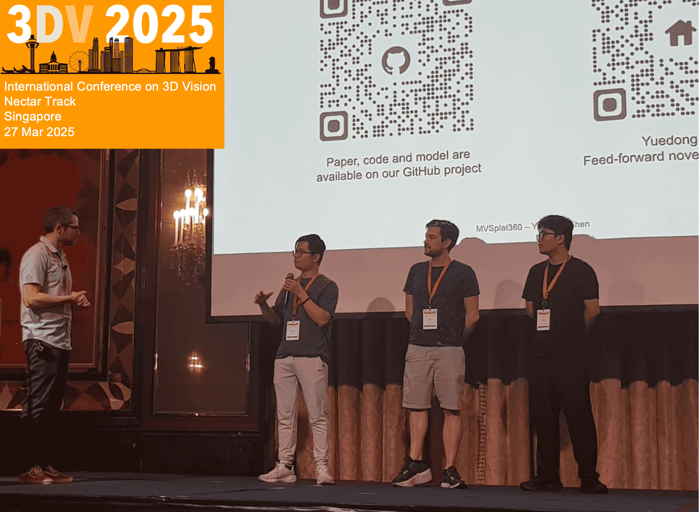
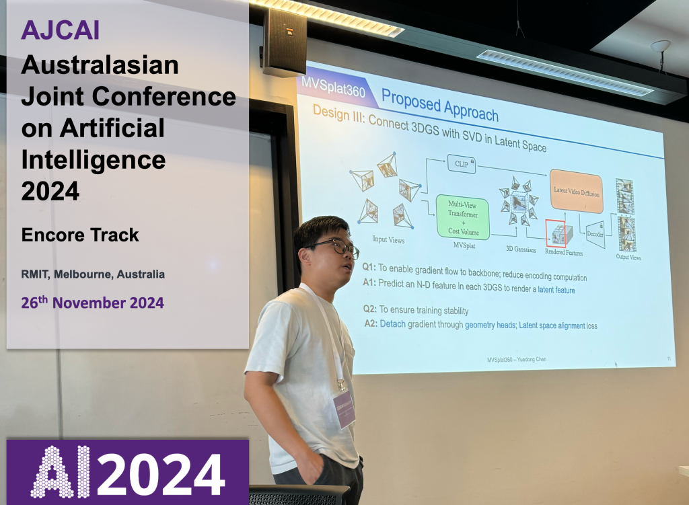
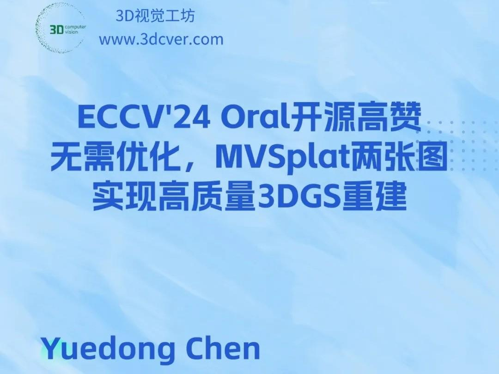

<h2 class="h1 index-header" id="about">About Me </h2>

I am a Researcher at the [Augmented Vision](https://av.dfki.de/) department of [German Research Center for Artificial Intelligence](https://www.dfki.de/web) (DFKI GmbH), working under the supervision of Dr. [Alain Pagani](https://av.dfki.de/members/pagani/) and Prof. [Didier Stricker](https://av.dfki.de/members/stricker/).  My research focuses on core challenges in computer vision, with a special emphasis on inferring 3D information from 2D data—particularly in the areas of generalizable 3D reconstruction, optical flow estimation, and novel view synthesis. In parallel, I contribute to the development of AR/VR applications, with a focus on interactive and immersive data visualization. My work aims to bridge foundational vision research with user-centered extended reality systems, enabling practical applications in augmented environments.

I earned my master's degree in [Computational Sciences in Engineering (CSE)](https://www.tu-braunschweig.de/en/cse) from [TU Braunschweig](https://www.tu-braunschweig.de/), Germany. For my master’s thesis, I worked under the supervision of Prof. [Nils Thuerey](https://ge.in.tum.de/about/n-thuerey/) at [TU Munich (TUM)](https://www.tum.de/) on developing efficient learning-based methods for particle simulations to generate physically accurate fluid animations for computer graphics.

During my studies, I gained practical experience through research internships at [Volkswagen AG](https://www.volkswagen-nutzfahrzeuge.de/de/elektrisch-und-autonom/autonomes-fahren.html) and the [German Aerospace Center (DLR)](https://www.dlr.de/de/ts/forschung-und-transfer/themen/verkehrssystem), where I worked on advanced perception algorithms for autonomous driving and user-focused driver-assistance systems.

My academic journey began with a Bachelor's degree in Mechanical Engineering from [Veermata Jijabai Technological Institute (VJTI)](https://vjti.ac.in/), India.

  <ul>
    <li> <a href="mailto:vemburajyadav1994@gmail.com" title="vemburajyadav1994@gmail.com" class="no-mark-external" target="_blank">  Email Donny's Email Address</a></li>
    <!-- <li> <a href="https://scholar.google.com/citations?user=GqgGZlQAAAAJ" title="Google Scholar" class="no-mark-external" target="_blank">  Google Scholar Donny's Google Scholar profile</a></li> -->
    <li> <a href="https://github.com/VemburajYadav" title="GitHub" class="no-mark-external" target="_blank">  GitHub Donny's Github</a></li>
    <li> <a href="https://www.linkedin.com/in/vemburaj-yadav" title="LinkedIn" class="no-mark-external" target="_blank">  LinkedIn Donny's LinkedIn</a></li>
    <li> <a href="https://twitter.com/yadav_vemburaj" title="Twitter" class="no-mark-external" target="_blank"> <svg xmlns="http://www.w3.org/2000/svg" width="15.2" height="15.5" fill="currentColor" class="bi bi-twitter-x" viewBox="0 0 16 16"><path d="M12.6.75h2.454l-5.36 6.142L16 15.25h-4.937l-3.867-5.07-4.425 5.07H.316l5.733-6.57L0 .75h5.063l3.495 4.633L12.601.75Zm-.86 13.028h1.36L4.323 2.145H2.865z"/></svg> Twitter Donny's Twitter</a></li>
  </ul>

---

<h2 class="h1 index-header" id="publications">Selected Publications </h2>
<!-- 
 🤖🧠👌🏼 He prefers simple yet effective solutions 
 -->

  
OptSplat: Recurrent Optimization for Generalizable Reconstruction and Novel View Renderings

  
Under Review

  
Vemburaj Yadav, Alain Pagani and Didier Stricker

  
[<a href="https://www.dropbox.com/scl/fi/wyv27h9uinfivfh4gxzu7/OptSplat.pdf?rlkey=cqc3zd55jyc9laz4y45zfd91g&st=vw71fezc&dl=0">paper</a>] [<a href="https://github.com/VemburajYadav/OptSplat">code</a>] [<a href="https://vemburajyadav.github.io/OptSplat">project page</a>] 

  <!-- 
 TL;DR: MVSplat360 is a feed‑forward model that combines 3DGS with SVD to achieve 360° NVS for complex scenes with less than 5 input views. 
  -->

  
MVSplat: Efficient 3D Gaussian Splatting from Sparse Multi-View Images

  
ECCV 2024 (Oral)

  
Yuedong Chen, Haofei Xu, Chuanxia Zheng, Bohan Zhuang, Marc Pollefeys, Andreas Geiger, Tat-Jen Cham, and Jianfei Cai

  
[<a href="https://arxiv.org/abs/2403.14627">arXiv</a>] [<a href="https://github.com/donydchen/mvsplat">code</a>] [<a href="https://donydchen.github.io/mvsplat">project
    page</a>] 

  
MuRF: Multi-Baseline Radiance Fields

  
CVPR 2024

  
Haofei Xu, Anpei Chen, Yuedong Chen, Christos Sakaridis, Yulun Zhang, Marc Pollefeys, Andreas Geiger, <i>et al.</i>

  
[<a href="https://arxiv.org/abs/2312.04565">arXiv</a>] [<a href="https://github.com/autonomousvision/murf">code</a>] [<a href="https://haofeixu.github.io/murf/">project
    page</a>] 

  
Explicit Correspondence Matching for Generalizable Neural Radiance Fields

  
arXiv 2023

  
Yuedong Chen, Haofei Xu, Qianyi Wu, Chuanxia Zheng, Tat-Jen Cham, and Jianfei Cai

  
[<a href="http://arxiv.org/abs/2304.12294">arXiv</a>] [<a href="https://github.com/donydchen/matchnerf">code</a>] [<a href="https://donydchen.github.io/matchnerf/">project
    page</a>] 

  
Sem2NeRF: Converting Single-View Semantic Masks to Neural Radiance Fields

  
ECCV 2022

  
Yuedong Chen, Qianyi Wu, Chuanxia Zheng, Tat-Jen Cham, and Jianfei Cai

  
[<a href="https://arxiv.org/abs/2203.10821">arXiv</a>] [<a href="https://github.com/donydchen/sem2nerf">code</a>] [<a href="https://donydchen.github.io/sem2nerf/">project
    page</a>] [<a href="https://www.youtube.com/watch?v=cYr3Dz8N_9E">demo video</a>] 

  
Object-Compositional Neural Implicit Surfaces

  
ECCV 2022

  
Qianyi Wu, Xian Liu, Yuedong Chen, Kejie Li, Chuanxia Zheng, Jianfei Cai, and Jianmin Zheng

  
[<a href="https://arxiv.org/abs/2207.09686">arXiv</a>] [<a href="https://github.com/QianyiWu/objsdf">code</a>]
    [<a href="https://wuqianyi.top/objectsdf/">project
      page</a>] [<a href="https://youtu.be/23vxOV19bEw">demo video</a>] 

  
Towards Unbiased Visual Emotion Recognition via Causal Intervention

  
ACM Multimedia 2022

  
Yuedong Chen, Xu Yang, Tat-Jen Cham, and Jianfei Cai

  
[<a href="https://arxiv.org/abs/2107.12096">arXiv</a>] [<a href="https://github.com/donydchen/causal_emotion">code</a>]
  

  
GeoConv: Geodesic Guided Convolution for Facial Action Unit Recognition

  
Pattern Recognition 2022

  
Yuedong Chen, Guoxian Song, Zhiwen Shao, Jianfei Cai, Tat-Jen Cham, and Jianmin Zheng

  
[<a href="https://arxiv.org/abs/2003.03055">arXiv</a>] 
    <!-- [<a href="#">code (coming soon)</a>] -->
  

  
Facial Motion Prior Networks for Facial Expression Recognition

  
VCIP 2019 (Oral)

  
Yuedong Chen, Jianfeng Wang, Shikai Chen, Zhongchao Shi, and Jianfei Cai

  
[<a href="https://arxiv.org/abs/1902.08788">arXiv</a>] [<a href="https://github.com/donydchen/FMPN-FER">code</a>]

   
  More on <a href="https://scholar.google.com.sg/citations?user=GqgGZlQAAAAJ&hl=en" target="_blank">Google Scholar</a>

---

<h2 class="h1 index-header" id="projects">Projects & Talks</h2>

  <ul>
    <li>28-01-2025, Invited talk "Feed-forward NVS from Sparse Inputs​" at <i>Amazon, Tel Aviv</i>, hosted by <a href="https://www.linkedin.com/in/lior-fritz-6457a796">Lior Fritz</a>.</li>
    <li>08-11-2024, Invited talk "Feed-forward Novel View Synthesis" at <i>Wayve, London</i>, hosted by <a href="https://www.linkedin.com/in/joepolin">Joe Polin</a>.</li>
  </ul>

  

    <a href="https://bsky.app/profile/donydchen.bsky.social/post/3lldtgeyitc2h" target="_blank">
      

    </a>
    
Invited talk at <a href="https://3dvconf.github.io/2025/call-for-nectar-track" target="_blank">3DV25 Nectar Track</a>

  

  

    <a href="https://ajcai2024.org/files/AJCAI_Booklet.pdf#page=15.09" target="_blank">
      

    </a>
    
Invited talk at <a href="https://ajcai2024.org" target="_blank">AJCAI 2024</a>

  

  <!-- 

    <a href="https://wayve.ai" target="_blank">
      

    </a>
    
Invited talk at WAYVE(London)

  
 -->

  

    <a href="https://eccv2024.ecva.net/virtual/2024/poster/1231" target="_blank">
      

    </a>
    
Oral presentation at ECCV 2024

  

  

    <a href="https://cepoca.cn/lectureHall/lectureRoomDetail/?liveUid=cd40fae9992618669ccf17e09efa7b76" target="_blank">
      

    </a>
    
Invited talk at SHUZIHUANYU

  

  

    <a href="https://www.bilibili.com/video/BV1sAWhe1ENw/" target="_blank">
      

    </a>
    
Invited talk at 3DCVer

  
  

  

    <a href="https://github.com/lyndonzheng/Pluralistic-Inpainting#gui" target="_blank">
      

    </a>
    
Demo at Monash Uni. <a href="https://www.monash.edu/open-day">Open Day 2022</a>

  

  
  

    <a href="https://github.com/donydchen/ganimation_replicate" target="_blank">
      

    </a>
    
A popular replication of <a href="https://github.com/albertpumarola/GANimation">GANimation</a>

  

---

<h2 class="h1 index-header" id="misc">Miscellanies</h2>

  <ul>
    <li>Conference Reviewer: ECCV('24), CVPR('23-'25), ICCV('23), NeurIPS(’24), ICLR(’25), ICML('25), 3DV(’24-’25), AAAI(’24), ACMMM(’21‑’24), ACCV(’24), ISMAR(’23,’24), IEEEVR(’24)</li>
    <li>Journal Reviewer: TPAMI, IJCV, TIP, TMM, TCSVT, TOMM, TVCJ, Computers & Graphics, The Visual Computer</li>
    <li>He is a native speaker of <a href="https://en.wikipedia.org/wiki/Teochew_dialect">Teochew</a>, fluent in English, Mandarin, <a href="https://en.wikipedia.org/wiki/Cantonese">Cantonese</a>, and also familiar with <a href="https://en.wikipedia.org/wiki/Singlish">Singlish</a>.
    </li>
  </ul>

  

